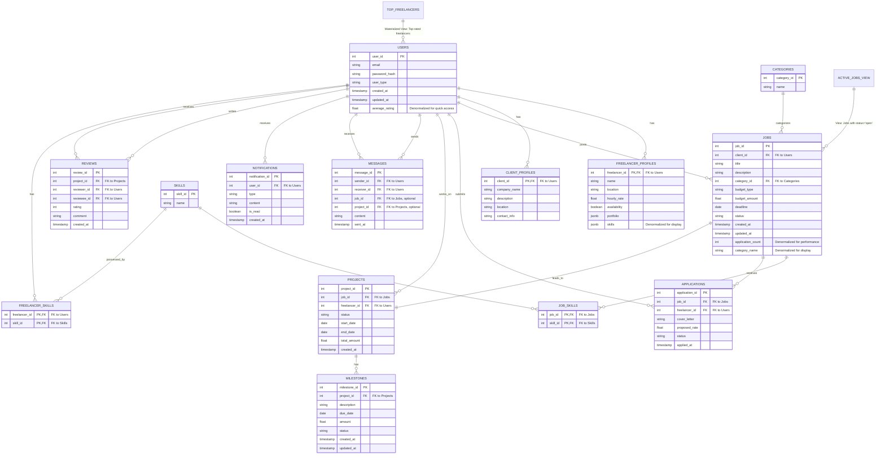

# SkillHire: ER Diagram

---

## Design Decisions

### 1. Normalization and Denormalization

- **Normalization:**
  - The schema is normalized to at least Third Normal Form (3NF) to minimize redundancy and ensure data integrity.
  - Separate tables for `FREELANCER_PROFILES` and `CLIENT_PROFILES` allow for user-type-specific attributes, while both reference the `USERS` table.
  - Many-to-many relationships are handled by junction tables:
    - `JOB_SKILLS` links jobs and required skills.
    - `FREELANCER_SKILLS` links freelancers and their skills.
- **Denormalization:**
  - Some fields are denormalized for performance:
    - `JOBS.application_count` stores the number of applications for quick access.
    - `JOBS.category_name` avoids frequent joins with `CATEGORIES` for display.
    - `USERS.average_rating` allows fast retrieval of a user’s rating.
    - `FREELANCER_PROFILES.skills` (JSONB) enables quick display of skills, complementing the normalized `FREELANCER_SKILLS` table.

### 2. Read-Heavy and Write-Heavy Tables

- **Read-Heavy Tables:**

  - `JOBS`: This table is frequently accessed by freelancers searching and browsing for available jobs. Since job listings are a core feature, optimizing for fast reads ensures a responsive user experience. The denormalized fields like `application_count` and `category_name` further reduce the need for expensive joins during these frequent reads.
  - `FREELANCER_PROFILES` and `CLIENT_PROFILES`: Profiles are often viewed by other users (clients viewing freelancers, freelancers viewing clients). Storing display-ready data (like denormalized skills in `FREELANCER_PROFILES`) allows for quick profile rendering.
  - `MESSAGES`: Messaging is a central feature, and users regularly check their conversations. Efficient reads are crucial for real-time chat and notifications.
  - `NOTIFICATIONS`: Users frequently check notifications for updates, so fast retrieval is important for engagement and timely alerts.

- **Write-Heavy Tables:**
  - `APPLICATIONS`: This table receives frequent writes as freelancers apply to jobs. The design supports high insert rates and ensures that application data is quickly available for both clients and freelancers.
  - `MESSAGES`: As users communicate, new messages are constantly being written. The schema supports high write throughput to maintain real-time communication.
  - `NOTIFICATIONS`: System and user actions generate notifications, resulting in frequent inserts. The structure allows for efficient batch and real-time notification creation.

### 3. Access Patterns and Rationale

- **Access Patterns:**

  - The schema is designed around the most common user actions: searching for jobs, viewing profiles, applying to jobs, messaging, and receiving notifications. By analyzing these patterns, the design ensures that the most frequent queries are efficient and require minimal joins or aggregations.
  - Many-to-many relationships (e.g., jobs and skills, freelancers and skills) are handled with junction tables (`JOB_SKILLS`, `FREELANCER_SKILLS`), enabling flexible querying and filtering without data duplication.
  - Denormalized fields (like `application_count`, `category_name`, and `average_rating`) are included to optimize for read-heavy scenarios, reducing the need for real-time computation or complex joins during high-traffic operations.
  - The separation of `FREELANCER_PROFILES` and `CLIENT_PROFILES` allows for tailored data storage and retrieval, supporting different user experiences and attributes for each user type.

- **Rationale for Structure:**
  - The structure prioritizes scalability and performance for a marketplace platform where read operations (browsing jobs, profiles, messages) vastly outnumber writes, but certain tables (applications, messages, notifications) must also handle high write volumes.
  - By balancing normalization (for data integrity and flexibility) with targeted denormalization (for speed), the schema supports both transactional consistency and fast, user-facing queries.
  - The use of junction tables and denormalized fields ensures that the system can efficiently support complex queries (e.g., "find all jobs requiring a specific skill" or "show a freelancer's average rating") without sacrificing maintainability or data quality.
  - This design enables the platform to deliver a responsive, reliable experience for both freelancers and clients, even as the user base and data volume grow.
